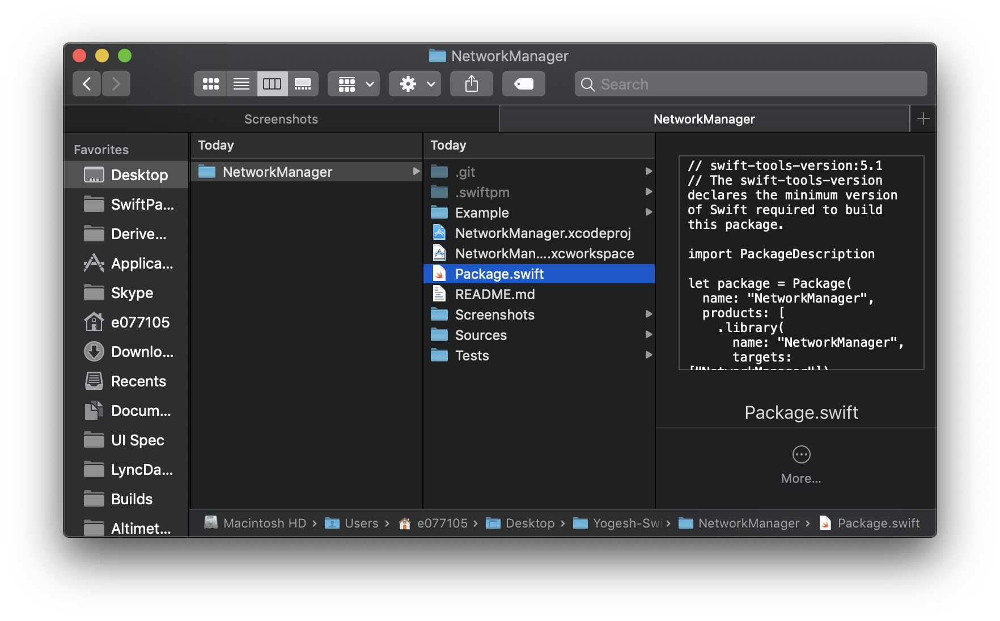
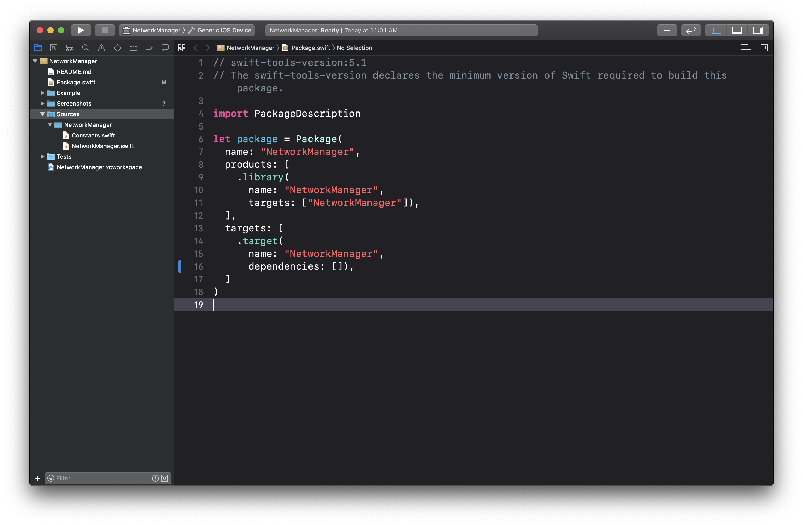
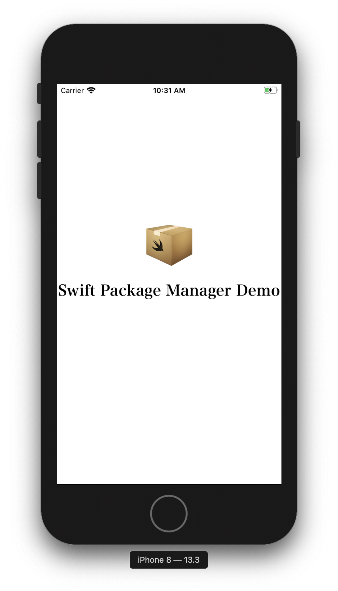
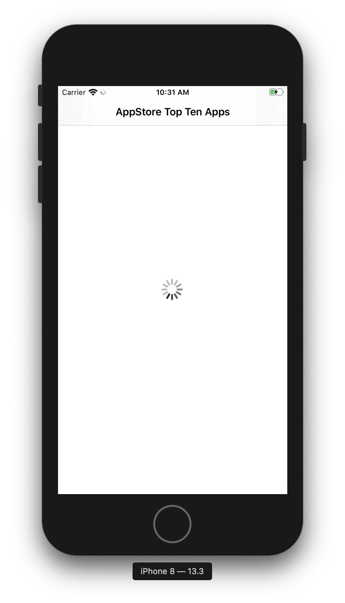
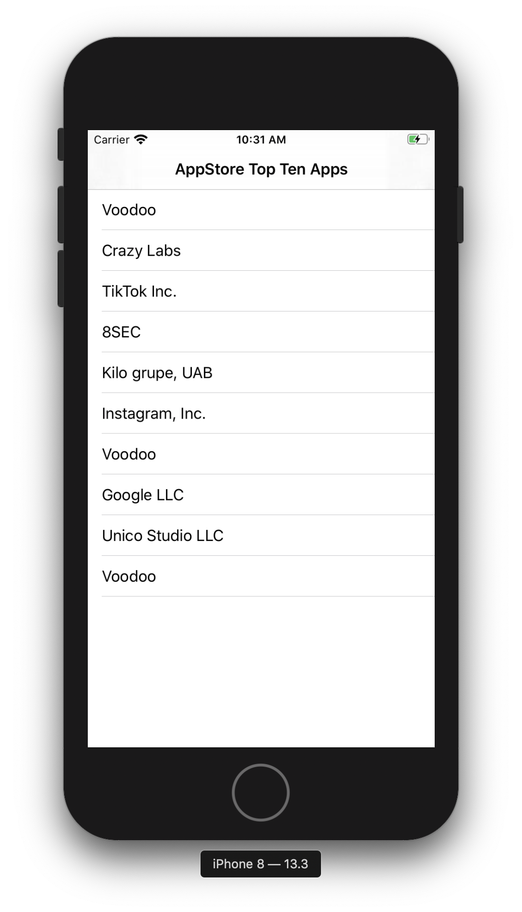

# NetworkManager

Network manager is a example of Swift Package Manager.
Network manager is responsible for resending the request to server using URLSession.

If you want to open the Swift Package manager, just double click on 'package.swift' file in project.
It'll open the Swift Package manager in Xcode.

# Test App
Example of Swift Package Manager app fetches the top tens free apps on app store.

